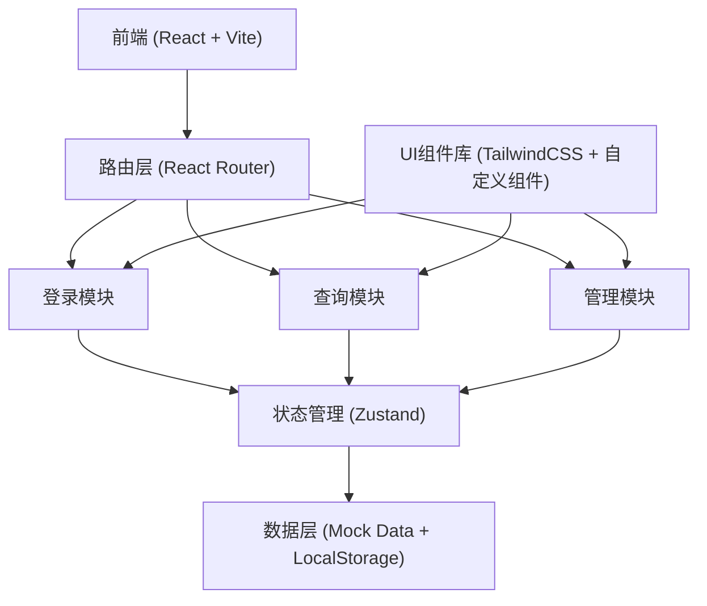
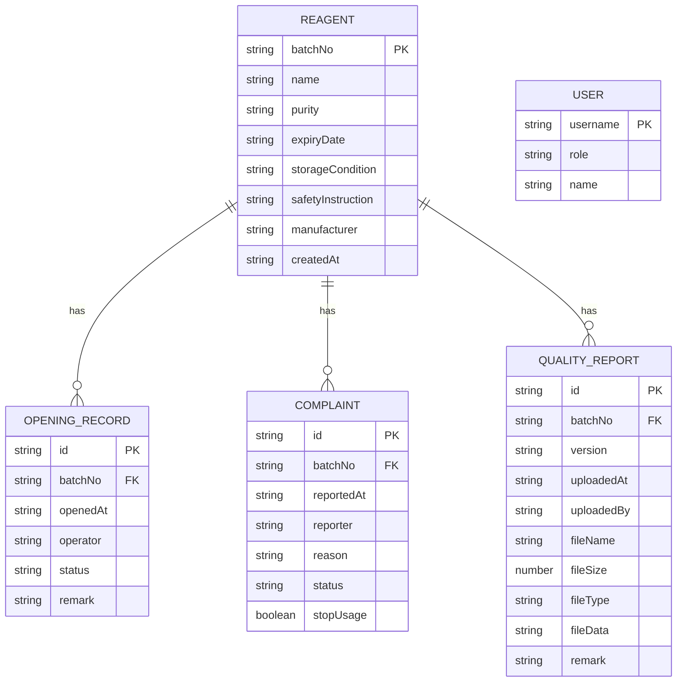

## 1. 架构设计



## 2. 技术描述

- 前端：React@18 + TypeScript + Vite@5
- 状态管理：Zustand (轻量、简单、性能好)
- 样式：TailwindCSS@3
- 路由：React Router@6
- 图标：Lucide React
- 数据存储：LocalStorage + Mock数据（无需后端，可直接运行）
- 初始化工具：npm create vite@latest

## 3. 路由定义

| 路由 | 用途 | 访问角色 |
|------|------|----------|
| /login | 登录页面，账号密码登录 | 所有 |
| /query | 试剂批号查询页面 | 实验人员、管理员 |
| /admin | 管理员控制台首页 | 管理员 |
| /admin/reagents | 试剂信息管理 | 管理员 |
| /admin/reports | 质检报告管理与上传 | 管理员 |
| /admin/complaints | 投诉记录管理 | 管理员 |
| /admin/reports/:batchNo/versions | 报告版本追溯 | 管理员 |
| * | 404页面 | 所有 |

## 4. 类型定义

```typescript
// 试剂信息
interface Reagent {
  batchNo: string;           // 批号（主键）
  name: string;              // 试剂名称
  purity: string;            // 纯度
  expiryDate: string;        // 到期日
  storageCondition: string;  // 储存条件
  safetyInstruction: string; // 安全说明
  manufacturer: string;      // 生产商
  createdAt: string;         // 创建时间
}

// 开封记录
interface OpeningRecord {
  id: string;
  batchNo: string;
  openedAt: string;          // 开封时间
  operator: string;          // 操作人员
  status: 'opened' | 'sealed'; // 状态
  remark?: string;           // 备注
}

// 投诉记录
interface Complaint {
  id: string;
  batchNo: string;
  reportedAt: string;        // 投诉时间
  reporter: string;          // 投诉人
  reason: string;            // 投诉原因
  status: 'pending' | 'resolved' | 'closed'; // 状态
  stopUsage: boolean;        // 是否停止使用
}

// 质检报告
interface QualityReport {
  id: string;
  batchNo: string;
  version: string;           // 版本号 v1.0, v1.1...
  uploadedAt: string;        // 上传时间
  uploadedBy: string;        // 上传人
  fileName: string;          // 文件名
  fileSize: number;          // 文件大小
  fileType: string;          // 文件类型
  fileData?: string;         // 文件数据 (base64)
  remark?: string;           // 备注
}

// 用户信息
interface User {
  username: string;
  role: 'experimenter' | 'admin';
  name: string;
}
```

## 5. 数据模型

### 5.1 ER图



### 5.2 数据初始化（Mock）

```typescript
// 初始化Mock数据
const mockReagents: Reagent[] = [
  {
    batchNo: 'RGT-2024-001234',
    name: '氯化钠分析纯',
    purity: '99.5%',
    expiryDate: '2026-12-31',
    storageCondition: '室温干燥处，密封保存',
    safetyInstruction: '避免接触眼睛和皮肤，操作时佩戴防护手套',
    manufacturer: '国药集团化学试剂有限公司',
    createdAt: '2024-01-15T10:30:00Z'
  },
  {
    batchNo: 'RGT-2024-005678',
    name: '无水乙醇',
    purity: '99.7%',
    expiryDate: '2025-06-30',
    storageCondition: '阴凉通风处，远离火源',
    safetyInstruction: '易燃液体，使用时注意通风，禁止明火',
    manufacturer: '上海化学试剂厂',
    createdAt: '2024-03-20T14:20:00Z'
  },
  {
    batchNo: 'RGT-2024-009999',
    name: '盐酸（36%-38%）',
    purity: 'AR级',
    expiryDate: '2027-03-15',
    storageCondition: '密封，存于通风橱内',
    safetyInstruction: '强腐蚀性，操作时佩戴护目镜和防酸手套',
    manufacturer: '北京化工厂',
    createdAt: '2024-05-10T09:15:00Z'
  }
];

const mockComplaints: Complaint[] = [
  {
    id: 'CMP-001',
    batchNo: 'RGT-2024-009999',
    reportedAt: '2024-11-05T11:00:00Z',
    reporter: '李研究员',
    reason: '试剂浓度不符合标准，实验结果异常',
    status: 'pending',
    stopUsage: true
  }
];
```

## 6. 核心模块设计

### 6.1 Store（Zustand）

```typescript
interface AppState {
  user: User | null;
  reagents: Reagent[];
  openingRecords: OpeningRecord[];
  complaints: Complaint[];
  qualityReports: QualityReport[];
  searchHistory: string[];
  login: (username: string, password: string) => boolean;
  logout: () => void;
  searchReagent: (batchNo: string) => Reagent | undefined;
  getOpeningRecords: (batchNo: string) => OpeningRecord[];
  getComplaints: (batchNo: string) => Complaint[];
  hasActiveComplaint: (batchNo: string) => boolean;
  getReports: (batchNo: string) => QualityReport[];
  uploadReport: (batchNo: string, file: File, remark?: string) => QualityReport;
  addComplaint: (complaint: Omit<Complaint, 'id'>) => Complaint;
  addReagent: (reagent: Reagent) => void;
  updateReagent: (batchNo: string, data: Partial<Reagent>) => void;
  deleteReagent: (batchNo: string) => void;
}
```

### 6.2 版本号生成规则

版本号格式：`v主版本号.次版本号`
- 首次上传：v1.0
- 后续上传：自动递增次版本号 v1.1, v1.2...
- 重大更新可手动指定主版本号
